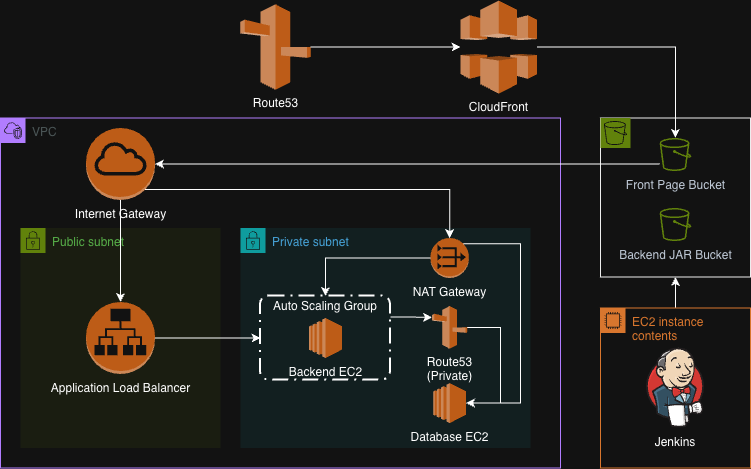

# dundemo-terraform
>dundemo 프로젝트에 필요한 인프라를 terraform을 사용하여 프로비저닝

## 1. 프로젝트 개요

이 리포지토리는 dundemo 프로젝트의 전체 인프라를 AWS에 프로비저닝하기 위한 Terraform 코드입니다. Terraform의 모듈식 접근 방식과 workspace 기능을 사용하여 네트워크, 데이터베이스, 애플리케이션(백엔드/프론트엔드), CI/CD 환경을 효율적이고 재사용 가능하게 관리합니다.

---

## 2. 아키텍처 다이어그램

</img>

---

## 3. 설계 중점

- **모듈성 (Modularity):** 각 기능 단위(VPC, DB, App 등)를 별도의 모듈로 분리하여 코드의 재사용성을 높이고 유지보수를 용이하게 합니다.
- **관심사 분리 (Separation of Concerns):** 애플리케이션 인프라 (`dundemo`)와 CI/CD 인프라 (`jenkins`)를 분리하여 서로 다른 생명주기를 가질 수 있도록 관리합니다.
- **환경 분리 (Environment Isolation):** Terraform Workspace를 사용하여 `dev`, `prod` 등 여러 환경을 동일한 코드로 관리할 수 있도록 구성했습니다. (`terraform.tfstate.d` 디렉토리 구조 참고)

### 디렉토리 구조

- **`dundemo/`**: 실제 애플리케이션(백엔드, 프론트엔드, DB)을 구동하기 위한 모든 AWS 리소스를 정의합니다.
- **`jenkins/`**: CI/CD 파이프라인을 실행하기 위한 Jenkins 서버 인프라를 정의합니다.

---
